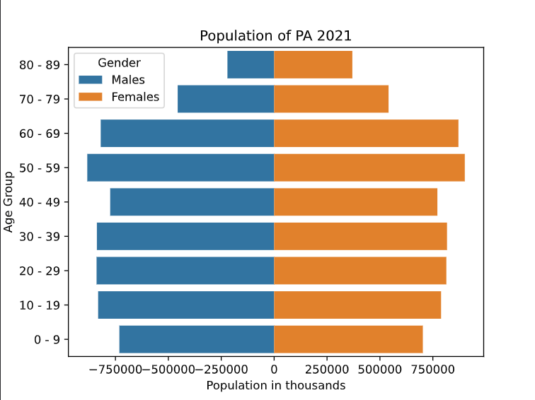

# Demographics-by-state

## Goal
The goal of the Python script is to automate data collection from the US population census. Provided with the data, the product for the script is to create a visualization of population data by each US state. The data is represented by a population pyramid bar graph and saved as a PDF file. The idea is to provide insight into the demographics of each state and the outlook of the state's economic activity. 

## Data Gathering
The population data is gathered using an API (Application Programming Interface). The US Census Bureau provides developers an opportunity to generate API token key to extract census data from their collection of datasets. The dataset American Community Survey 5 - year Data (2009 - 2021) is utilized in this python script. The 5-year estimates from the ACS (American Community Survey) are "period" estimates that represent data collected over a period. The primary advantage of using multiyear estimates is the increased statistical reliability of the data for less populated areas and small population subgroups.

## Census API Concepts
1. **Variables**: A variable is each unit of data you are searching for in a dataset. Each variable that you can search for in a dataset has a name, which may be an acronym or meaningful on its own; e.g., STNAME, POP, DATE_. In larger datasets, such as the American Community Survey, many of these names are based on an alphanumeric code; e.g., B01003_001E (Total Population).
2. **Labels**: Provides a description of the Variables in a dataset.

## Setup
1. The Demographics_by_state is developed using Python virtual environment. The link for the virtual environment tool used for this project is [https://github.com/pyenv/pyenv-virtualenv](https://github.com/pyenv/pyenv-virtualenv).
2. The Python version for the script was 3.10. The Python version management tool used for this project was: [https://github.com/pyenv/pyenv](https://github.com/pyenv/pyenv)
3. Run the following command to install the necessary Python libraries to run the script: 
`pip3 install -r requirements.txt`
4. Request US Census API key from the following website: [https://api.census.gov/data/key_signup.html](https://api.census.gov/data/key_signup.html)
5. Insert the API key into the script line 24 as a first argument. Leave the year unchanged since ACS has dataset available upto the year 2021. `c = Census("INSERT API KEY", year=2021)`
6. Run the Python script and provide the state as an argument. Example: `python3 index.py md` or `python3 index.py fl`. State abbreviation is required as an argument. 

## PDF example

